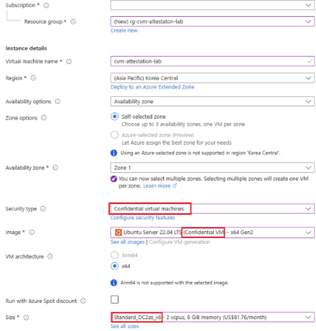

# Azure Confidential VM Guest Attestation Workshop

이 워크샵은 **Azure Confidential VM (AMD SEV-SNP, Intel TDX)** 환경 게스트 OS 내부에서 **Microsoft Azure Attestation (MAA)** 서비스를 이용하여 **CVM의 무결성을 증명(Attestation)** 하는 과정을 실습하는 예제입니다.

> 본 워크샵은 [Azure/confidential-computing-cvm-guest-attestation](https://github.com/Azure/confidential-computing-cvm-guest-attestation) Repository 를 참고하였으며, **한국 리전 (Koreacentral)** 및 CVM Attestation에 집중하여 새로이 작성되었습니다.

---

## 개요

Azure Confidential VM(이하 CVM)은 하이퍼바이저나 호스트 OS로부터 격리된 상태로 실행되어 VM 내부의 데이터와 코드의 무결성을 보장합니다.  
Microsoft Azure Attestation(MAA) 서비스를 통해 CVM 내부에서 **Attestation Report를 생성하고 서명된 JWT 토큰을 획득**하여  CVM이 신뢰할 수 있는 상태임을 외부 서비스에 증명할 수 있습니다.

> 참고: [Azure Korea Blog – Azure Attestation: Confidential VM 보안 검증](https://microsoft.github.io/azurekorea/azure-attestation/)

---
## 사전 요구사항

- Azure Subscription
---

## 1단계 - Azure Portal 에서 Confidential VM 생성
1. Azure Portal 접속 → [https://portal.azure.com](https://portal.azure.com)
2. 상단 검색창에 “Virtual Machines” 입력 → Create → Azure virtual machine
3. 아래 항목을 입력합니다.


| 항목 | 값 |
|------|----|
| **Subscription** | (본인 구독 선택) |
| **Resource group** | `rg-cvm-attestation-lab` (예시) |
| **Virtual machine name** | `cvm-attestation-lab` (예시) |
| **Region** | `Korea Central` |
| **Security type** | `Confidential virtual machines` |
| **Image** | `Ubuntu Server 22.04 LTS (Confidential VM) – x64 Gen2` |
| **Size** | `Standard_DC2as_v6` (AMD SEV-SNP 기반) |
| **Username** | `azureuser` (예시) |
| **Inbound ports** | SSH (22) 허용 |

4. “Disks → Networkiing → Management → Monitoring → Advanced → Tags → Review + Create” 순으로 검토 후 생성합니다.
5. VM 생성 완료 후, SSH로 접속합니다.

```bash
ssh azureuser@<VM_PUBLIC_IP>
```
---

## 2단계 - Sample App 실행 환경 준비
1. 리포지토리 클론

```bash
git clone https://github.com/wonsungso/confidential-computing-cvm-guest-attestation.git
cd confidential-computing-cvm-guest-attestation/cvm-attestation-sample-app/
```

2. 클라이언트 라이브러리 빌드 및 설치

```bash
sudo bash ClientLibBuildAndInstall.sh
```

> 해당 스크립트는 `scripts/build.sh 및 scripts/pre-requisites.sh` 스크립트를 실행하여 `azguestattestation1_1.0.5_amd64.deb` 패키지 및 실습에 필요한 패키지를 설치합니다.

---

## 3단계 – Attestation 클라이언트 빌드

```bash
cmake .
make
```
---

## 4단계 – JWT 토큰 생성 및 출력

```bash
sudo ./AttestationClient -o token; echo
```

출력 예시:

```
eyJhbGciOiJSUzI1NiIsImprdSI6Imh0dHBzOi8vc2hhcmVkZXVzMi5ldXMyLmF0dGVzdC5henVyZS5uZXQvY2VydHMiLCJraWQiOiJKMHBBUGRmWFh...
```

> 이 명령은 CVM 내부에서 **Guest Attestation Report** 를 생성하고,이를 **Microsoft Azure Attestation(MAA)** 서비스에 전송하여 MAA가 서명한 **JWT 토큰(JSON Web Token)** 을 반환합니다.
---

## 5단계 – JWT 페이로드 디코드 및 파싱

```bash
sudo ./AttestationClient -o token | cut -d '.' -f2 | base64 -d 2>/dev/null | jq .
```

출력 예시:

```json
{
  "iss": "https://sharedkrc.krc.attest.azure.net",
  "x-ms-attestation-type": "azurenvm",
  "x-ms-azurevm-vmid": "91055A8C-F759-42CE-B917-AC0B2E39B9F3",
  "x-ms-sevsnpvm-bootloader-svn": 10,
  "x-ms-sevsnpvm-firmware-svn": 23,
  "x-ms-sevsnpvm-reportid": "0174eba3fc786a52a610ec471927e75a1ad6e884c5a97a8d97672f79ba24d776",
  ...
}
```

> 이 명령은 JWT의 **Payload(Base64 encoded)** 부분을 디코드하여 JSON 형태로 출력합니다.

#### 주요 필드 해석

| 필드 | 설명 |
|------|------|
| `iss` | 토큰 발급자 (MAA 엔드포인트 URL) |
| `x-ms-attestation-type` | 어테스테이션 유형 (`azurenvm` = Confidential VM) |
| `x-ms-azurevm-vmid` | VM 인스턴스 고유 ID |
| `x-ms-sevsnpvm-bootloader-svn` | SEV-SNP 부트로더 보안 버전 |
| `x-ms-sevsnpvm-firmware-svn` | SEV-SNP 펌웨어 버전 |
| `x-ms-sevsnpvm-reportid` | 어테스테이션 세션 고유 ID |
| `exp`, `nbf` | 토큰 유효기간 (UNIX timestamp) |

> 이 디코드 된 토큰은 외부 서비스(API Gateway, Policy Server 등)에 제출하여 “이 요청이 신뢰된 Confidential VM에서 발급된 것임”을 증명하는 데 사용할 수 있습니다.

---

## 리소스 정리

1. Azure Portal 에서 생성한 `rg-cvm-attestation-lab` 을 삭제합니다.
---

## 참고 문서

- [Azure Attestation: Confidential VM 보안 검증 (Azure Korea Blog)](https://microsoft.github.io/azurekorea/azure-attestation/)
- [Azure/confidential-computing-cvm-guest-attestation (GitHub)](https://github.com/Azure/confidential-computing-cvm-guest-attestation)
- [Microsoft Learn – What is Microsoft Azure Attestation?](https://learn.microsoft.com/ko-kr/azure/attestation/basic-concepts)
- [Azure Confidential VM documentation](https://learn.microsoft.com/ko-kr/azure/confidential-computing/confidential-vm-overview)

---
> Author : [Wonsung So](https://github.com/wonsungso)  
> Microsoft Korea – Azure Solution Engineer
